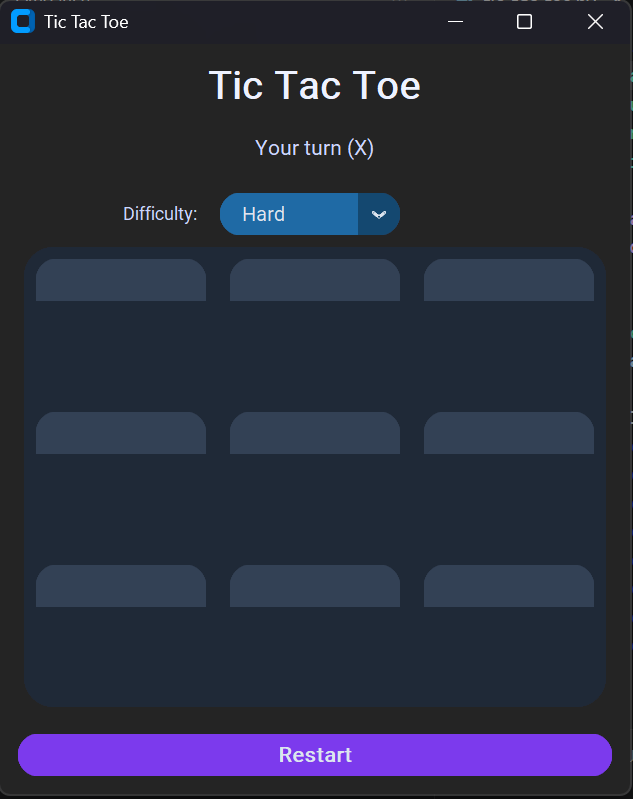

# Tic Tac Toe AI Game

A modern Tic Tac Toe game built with Python and CustomTkinter featuring an AI opponent and multiple difficulty levels.

## Screenshot


## Features
- Modern UI using CustomTkinter  
- AI opponent using Minimax algorithm  
- Easy, Medium, Hard difficulty levels  
- Win / Lose / Draw detection  
- Restart option  

## AI System
The AI uses the Minimax algorithm to evaluate all possible moves and choose the best one.

## How to Run
```bash
pip install customtkinter
python tic_tac_toe.py

> 📌 This project was created for learning purposes to practice GUI development and AI algorithms in Python.
